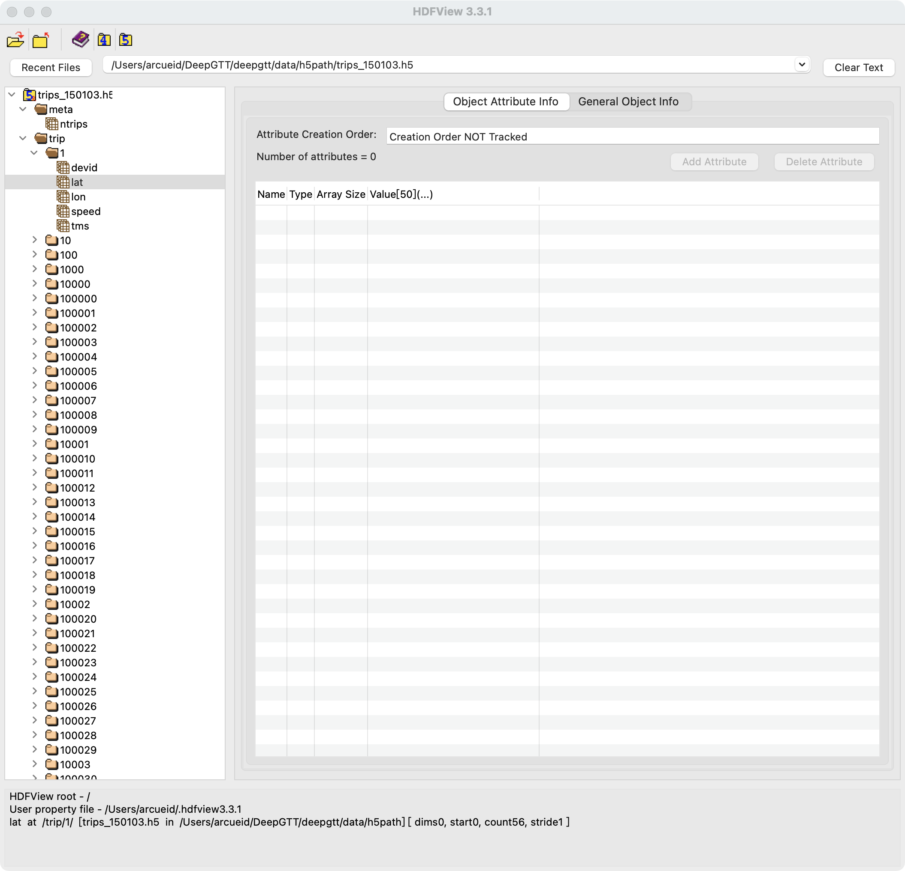
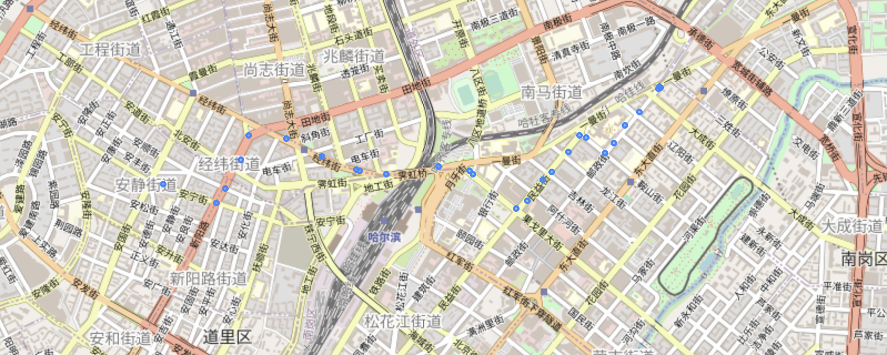
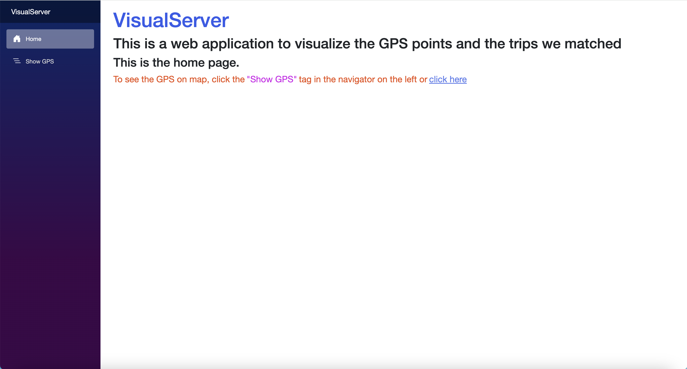
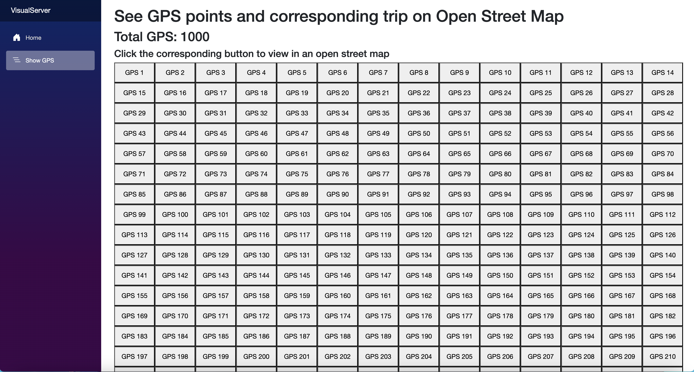
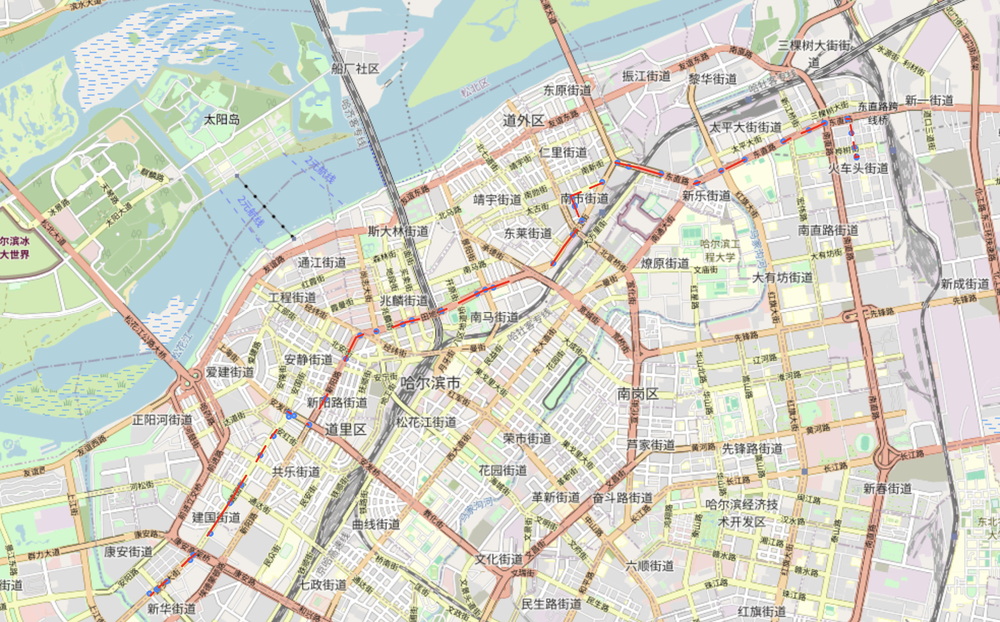

# 基于Hidden Markov map matching的GPS路径匹配与可视化

## 摘要

轨迹数据简单来说就是一系列带时间戳的经纬度点，而我们有时候更想知道的是某一条轨迹走过了哪些路段，因此我们就需要对轨迹数据进行map matching，从而得到某轨迹数据最可能走过的路网中的路段。本文基于Hidden Markov map matching进行匹配，并且使用Visual Server对结果进行了互动地图的可视化。

## 介绍

轨迹数据通常是一个序列$Seq$，该$Seq$由一系列$Tuple$(元组)组成:

$$
    Tuple = (lon, lat, timestamp)
$$

其中，$lon$表示经度，$lat$表示纬度，$timestamp$为该点对应的时间戳。于是：

$$
    Seq = [Tuple_1, Tuple_2, ...]
$$

一个序列$Seq$即为一条轨迹数据

我们将利用该轨迹数据，通过Hidden Markov map matching [1]，将其与路网上的路段进行匹配，并在可交互式地图上可视化匹配的结果。

源码位于仓库[Visual Server](https://github.com/ArcueidType/Visual-Server---Trajectory-MapMatching-Visualize)

### 部分代码参考以下仓库：

- [Barefoot](https://github.com/boathit/barefoot)
- [DeepGTT](https://github.com/boathit/deepgtt) [2]

## 基础环境准备

### 操作系统

MacOS(M2) (技术上所有系统都可行)

### 数据集

- OpenStreetMap开源地图数据

- [哈尔滨市出租车轨迹数据](https://drive.google.com/open?id=1tdgarnn28CM01o9hbeKLUiJ1o1lskrqA)(h5文件格式)

### Map Server

Map Server的作用是搭建一个**PostgreSQL**数据库，在本地作为服务器为后续**Map Match**和**行程的可视化**提供地图数据(来自Open Street Map)

1. 需要准备的环境
    
    * Docker
    * [osmosis](https://wiki.openstreetmap.org/wiki/Osmosis/Installation) 
    * java
    * 在barefoot内操作

2. 下载**Open Street Map**上的数据集并提取出我们要的区域(哈尔滨市区)

    ```bash
    // 以下指令下载地图数据，我配置好的镜像已经包括了osm路网数据，技术上不需要再下载并划分地图数据
    cd barefoot/map/osm/

    curl http://download.geofabrik.de/asia/china-latest.osm.pbf -o barefoot/map/osm/china.osm.pbf

    osmosis --read-pbf file=china.osm.pbf --bounding-box left=126.506130 right=126.771862 bottom=45.657920 top=45.830905 --write-pbf file=harbin.osm.pbf
    ```

3. 拉取配置好的Docker镜像

    > 这里可以直接使用我已经配置好的镜像(包括所需数据库的数据也已经导入好)

    ```
    docker pull arcueidtype/barefoot_map
    ```

    从头配置请参考[Barefoot](https://github.com/boathit/barefoot)仓库

4. 创建Docker容器
    ```
    docker run -it -p 5432:5432 --name="harbin-map" -v ${PWD}/map/:/mnt/map arcueidtype/barefoot_map:latest
    ```

5. 将OSM的数据导入数据库

    >这一步如果使用上述镜像,已经有数据库的话就不需要操作了，如果要操作，则是在运行中的容器中执行，而不是本机

    ```
    bash /mnt/map/osm/import.sh
    ```

6. 用pgAdmin(v4.24)检查数据库导入情况

    连接到服务器，地址`127.0.0.1`，端口`5432`，如果看到以下十张表就算成功了

    

    可以可视化数据集中的**兴趣点(POI)**和**道路**

    >由于兴趣点过多，这里只展示了一小部分

    

    >道路(局部)

    

### Matching Server

Matching Server基于Hidden Markov Map Matching [1]，处理传入的位置数据，将他们匹配到对应的路径上，并给出匹配好的路径编号

1. 需要准备的环境

    * Maven
    * Java JDK7(版本过高会出问题)

2. 为Barefoot打包并添加依赖

    ```bash
    mvn package -DskipTests
    ```

    若无法成功可以参考原仓库重新搭建 [Barefoot](https://github.com/boathit/barefoot)

3. 运行Matching Server

    ```bash
    java -jar target/barefoot-0.1.5-matcher-jar-with-dependencies.jar --slimjson config/server.properties config/harbin.properties
    ```

### 数据准备

请将下载的h5文件放在目录`server/data/h5path`中

[下载数据集](https://drive.google.com/open?id=1tdgarnn28CM01o9hbeKLUiJ1o1lskrqA)(为h5文件)

下载并解压后，可以使用**HDFView**来查看下载下来的数据集内容



可以看到，我们拿到的数据集中包括了该文件中总行程数。对于每个行程，都有经纬度，时间戳组成的序列。(还有一些额外的信息，包括速度，司机等)

可视化一条轨迹，如下：



>可以发现，由于采样间隔时间问题，GPS点可能会较为稀疏，导致match后的路径并不连续。事实上，大部分匹配出来的路径都不是连续的，但是这些路段已经完全足够让我们恢复出所有路段，或者训练一些模型，如 DeepGTT [2]

### Map Matching以及结果的可视化

上述 Matching Server 提供了一个接口，输入为一条轨迹数据，输出则为该轨迹数据Map Matching后得到的对应的路段id

> 具体接口使用方式不做赘述。

但是得到的仅仅是osm的路段id，我们并不能直观的看到结果，所以我们通过osm对匹配结果进行可视化，示例：


## Visual Server

Visual Server是基于`.NET CORE 8.0`搭建的网站，可以通过可视化的按钮选择不同的轨迹以方便的可视化对应该轨迹及其Map Matching的结果

由于时间有限加上美术设计能力不足，界面并不好看......

>由于数据集过大，并没有读取全部的数据，只截取了部分！

Visual Server网页：





通过单击相应的按钮，就能可视化的查看对应编号的数据：



### Visual Server原理简介：

Visual Server的运行基于一个本地Socket服务器：`GPS Matching Server`

该服务器会提前读取好轨迹的数据集，然后监听请求

Visual Server通过Socket通信，发送需要可视化的编号给GPS Matching Server

服务器收到编号后，对相应的轨迹进行Map Matching，并绘制对应的内容，然后将html文件(绘制好的地图其实是一个html文件)交给Visual Server

最后由Visual Server再将该html文件展示给用户(通过浏览器)

所以正常使用建立在三个服务器都正常运行的条件下

在VisualServer目录下输入dotnet watch即可启动Visual Server

## 结论

Hidden Markov map matching [1] 的结果非常不错，通过可视化的将结果展示出来，可以看出该方法得到的路径是比较合理的，不会产生直接匹配最近的路段造成的奇怪的路径。但是由于GPS点的离散程度较高，路网的密度较高，导致部分结果的路段较为离散，但由于有时间戳存在，在模型训练 [2] 等其他工作中，这样的结果仍然可以很好的发挥作用。

## 参考文献

[1] Paul Newson and John Krumm. 2009. Hidden Markov map matching through
noise and sparseness. In SIGSPATIAL 2009, November 4-6, 2009, Seattle, Washington,
USA, Proceedings. 336–343.

[2] Xiucheng Li, Gao Cong, Aixin Sun, and Yun Cheng. 2019. Learning Travel Time Distributions with Deep Generative Model. In Proceedings of the 2019 World Wide Web Conference (WWW ’19), May 13–17, 2019, San Francisco, CA, USA. ACM, New York, NY, USA, 11 pages. https://doi.org/10.1145/3308558.3313418